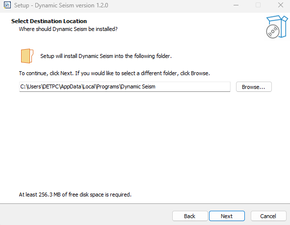
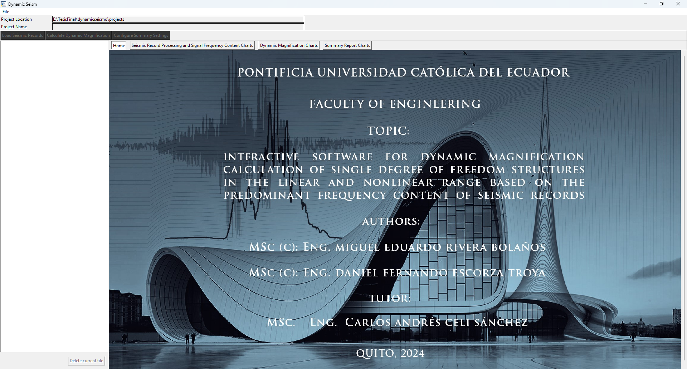
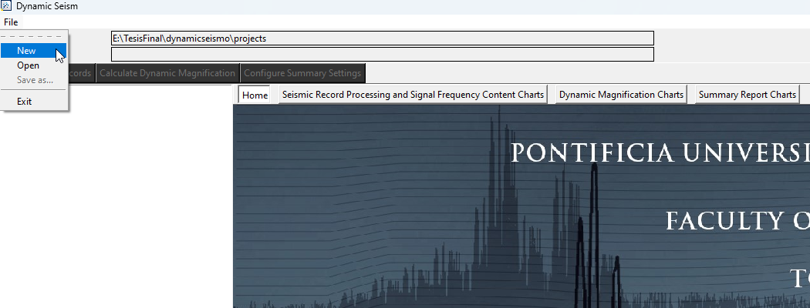
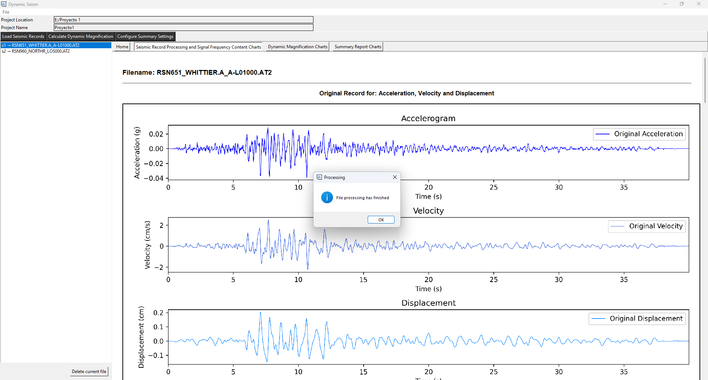
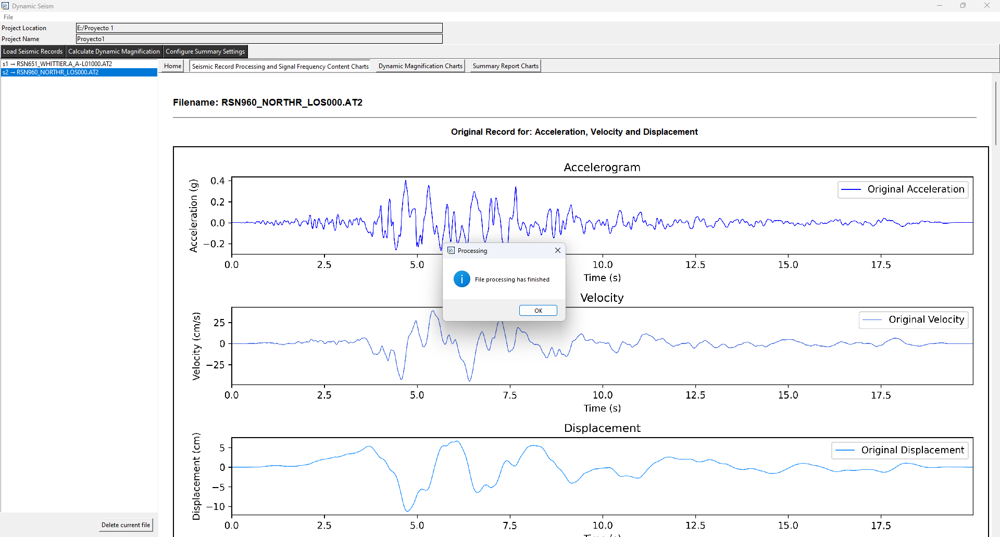
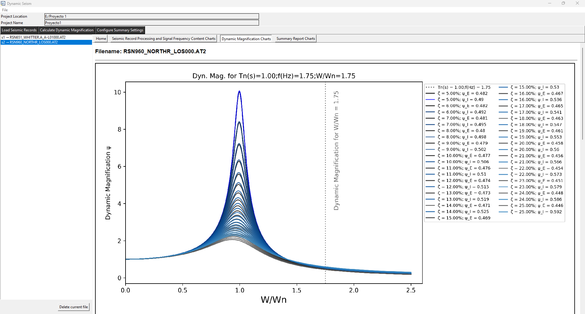
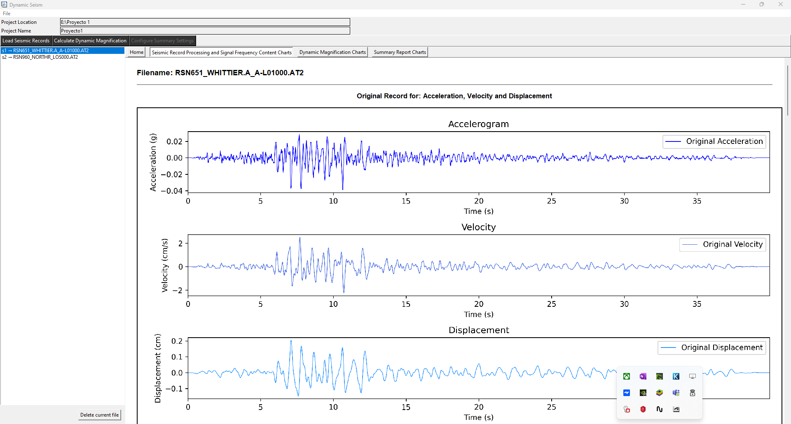
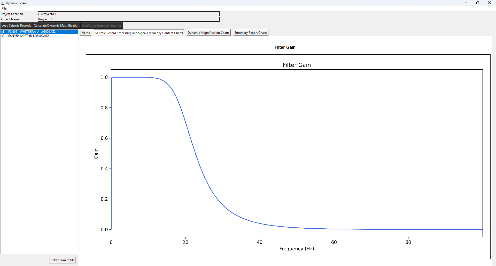
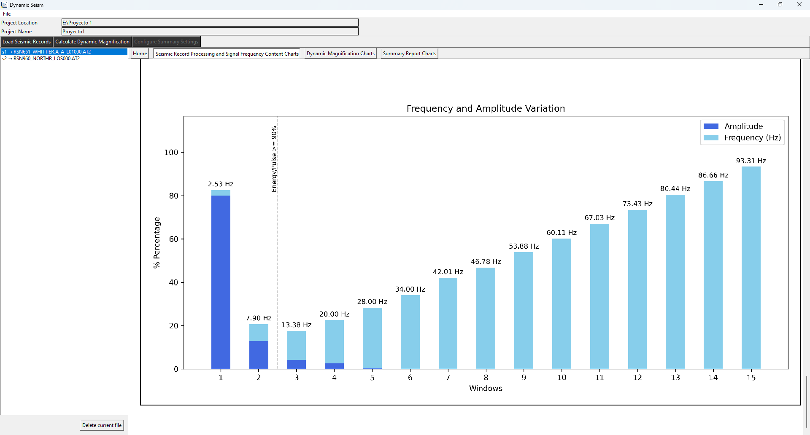

# Software Dynamic Seism

    

## Description

Interactive Software for Dynamic Magnification Calculation of Single Degree of Freedom Structures in the Elastic and Inelastic Range Based on the Predominant Frequency Content of Seismic Records.

## Functionalities

- Process Multiple Seismic Records (Baseline Correction and Filtering of Multiple Seismic Records).
- Plot time series of acceleration, velocity, and displacement from original and processed data.
- Plot the filter gain applied to the seismic record.
- Plot Arias intensity and calculate the significant duration of the seismic record.
- Comparative plot of seismic record acceleration vs. acceleration corresponding to significant duration.
- Plot the Fourier spectrum.
- Plot the frequency content analysis of the seismic record.
- Calculate dynamic magnification.
- Plot dynamic magnification curves.
- Generate bar charts that relate the seismic event energy, frequencies, and dynamic magnification calculated for the elastic and inelastic ranges when at least 11 seismic records are loaded into the software.
- Generates charts that overlay the probability density functions (PDFs) of frequencies and dynamic magnifications, along with grouped histograms for different damping values. Each chart includes means, standard deviations, and probabilities corresponding to the 16th, 50th, and 84th percentiles. This function is activated only after at least 11 seismic records have been loaded into the software.
- Generate reports in PDF format with all graphs.
- Generate reports in Excel.

<!--
## Installation Requirements

The software requires the following:
- Operating System: Windows 10 or higher.
- Recommended Processor: Intel Core i7.
- Available Disk Space: 530 MB.
- Recommended Screen Resolution: 1920x1080 pixels.
- Installation of External Tools: wkhtmltopdf.
-->

## Installer

Download the software installer by clicking on the following image:

  

<!--
https://puceeduec-my.sharepoint.com/:u:/g/personal/meriverabo_puce_edu_ec/EX8Twoe_aGpIqtDKmPnoF6MBTavRt1THmwoqVWpqfrq4Bg?download=1
-->

## How Install and Configurate the External Tool wkhtmltopdf?
- Download the wkhtmltopdf tool from the link provided in the table below

    

| Name                  | Description                                                                                   | Website                                                      |
|-----------------------|-----------------------------------------------------------------------------------------------|---------------------------------------------------------------|
| wkhtmltopdf           | Convert the files from HTML format to PDF                                                      | [https://wkhtmltopdf.org/index.html](https://wkhtmltopdf.org/index.html) |

- Run the wkhtmltopdf tool as an administrator and install it

  

- Read and accept the license agreement, then click 'I Agree'

  

- Choose an installation path, then click "Install"

- Once the installation is complete, click 'Close'

- Copy the path of the "bin" folder located within the wkhtmltopdf installation directory, which by default is "C:\Program Files\wkhtmltopdf\bin"

- Open the Environment Variables editor. Press Windows + S, then search for "Edit the System Environment Variables" and open it

- Clic on "Environment Variables"
  

- Edit the Path variable, either for system variables or for a specific user.

- Clic on "New"

- Paste the path of the "bin" folder. If the path is set to the default, it will be: "C:\Program Files\wkhtmltopdf\bin". Then click "Ok" on all subsequent windows to apply the changes.

## Installation Steps for Dynamic Seism:

- Install and configure the tool wkhtmltopdf. This step has been explained previously and it is recommended to review the section **"How to Install and Configure the External Tool wkhtmltopdf?"**

- Run the Dynamic Seism software as an administrator

- Select the installation folder path for the software and click on Next

- Check the option labeled "Create a desktop shortcut" then click Next.

- Verify that the installation path is correct and that an icon is created on the desktop, then click Next.
  

- Wait while the installation proceeds

- A window will appear notifying you that the software has been installed. Then, click on Finish

## Main Windows

## How to Create a New Project?

- Click on the File menu

- Click on New

- Select the folder that will host the new project

- Assign a name to the project

## How to load, process, and analyze the frequency content of the project's seismic records?
It is important to note that before loading the records, a new project must be created. To do this, refer to the section **"How to Create a New Project?"**

The steps to load seismic records into a project, process them by correcting the baseline or applying filters, and analyze their frequency content are as follows:

- Clic on "Load Seismic Records"

- Clic on "Select Files"

- Select the seismic project's seismic records
Select the project's seismic records. Keep in mind that you can choose both .txt and .AT2 files. To select .txt files, check the "text files" option, and for .AT2 files, check the "information files" option. A project in the software can include seismic records in both formats.

- Enter the data to process and analyze the frequency content of the seismic records.
  
The data to be entered for analyzing and processing the seismic records are as follows:

**Data Presentation:** Seismic records can commonly be presented in three types: Simple Column, Multiple Column, and Time Acceleration.

**Useless Rows:** Seismic records often contain information that should be ignored to focus on acceleration data. Useless rows refer to those that the software should omit to capture the acceleration data in the seismic record. The user should enter a natural number for this.

**Acceleration Units:** Refers to the units in which accelerations are expressed in the seismic record. The user has the option to work in two units: fraction of gravity (g) and centimeters per second squared (cm/s²).

**Conversion Factor:** This factor allows the user to convert the acceleration units in the seismic record and to scale the seismic record. The user can enter a decimal number.

**Time Interval Between Acceleration Measurements (Dt):** Typically, the first lines of text in the seismic record contain information on the time interval between each acceleration measurement. The user should enter this data after reviewing these informational lines. A positive decimal number is allowed.

**Baseline Correction:** The user has the option to correct the baseline to remove a trend in the seismic record. The user can choose between Yes or No.

**Baseline Correction Polynomial Degree:** The user must enter the degree of polynomial regression for baseline correction in the seismic record. The user should enter a natural number.

**Filter Type:** Filters are applied to remove noise from the seismic record. The software uses a Butterworth filter, offering the user three options: Highpass, Lowpass, and Bandpass. There is also an option for "None" to apply no filter to the seismic record.

**Cutoff Frequency 1 and 2:** Cutoff Frequency 1 refers to the minimum frequency allowed through in the case of a bandpass filter, while Cutoff Frequency 2 represents the maximum frequency allowed with minimal attenuation. These two frequencies define a range of interest in the signal. Decimal numbers are allowed.

**Filter Order:** Refers to how quickly the filter attenuates frequencies outside a passband. The software only allows the entry of a natural number for this data entry.

**Number of Windows:** The number of windows in which the Fourier Spectrum is divided helps identify the most representative frequencies of the seismic record, which assists in determining which frequencies contain 90% of the earthquake's energy. The user should enter a natural number.

**For example 1:**

Once the data is entered, click on Apply

**For example 2:**

Once the data is entered, click on Apply

- After entering the data for all seismic records in the project, click OK.

- Wait for the software to display a window with the message: "File processing has finished," and then click OK.

- To view the corresponding results, click on the tab "Seismic Record Processing and Signal Frequency Content Charts".

- Click on the names of the records listed on the left side. With the corresponding tab active, their results will be displayed

## How to Calculate Dynamic Magnification?

A project must be created in the software, as outlined in the section: **How to Create a New Project?.**
Additionally, seismic records must be processed and their frequency content analyzed, as detailed in the section: **How to load, process, and analyze the frequency content of the project's seismic records?.**
Next, follow these steps:

- Click on "Calculate Dynamic Magnification"

- Click on "Calculate Dynamic Magnification"

- Enter the data for calculating dynamic amplification.

Note the following:

**Initial and Final Damping Coefficients (Zeta 1 and Zeta 2):** The software allows plotting dynamic amplification curves for various damping values. The initial damping (Zeta 1) sets the lower limit, while the final damping (Zeta 2) defines the upper limit of a range of values.

**Damping Coefficient Variation (Delta Zeta):** The user must specify an increment in the damping values to create a sequence of values, gradually ranging from the initial to the final damping.

**Period:** This refers to the period of the structure and is used to calculate dynamic amplification values based on the predominant frequency content of the seismic records and the range of damping values entered by the user.

For Example:

Once the data has been entered, click OK

- Wait until a window appears with the message: "File processing has finished," and then click OK.

- Click on the tab "Dynamic Magnification Charts" to view the charts

- Click on the names of the records listed on the left side. With the corresponding tab active, the dynamic amplification results will be displayed.

## What Files and Folders Make Up a Project?

A project consists of two folders named file and results, and another file called _sismoanalyticsproject with the extension .sisproj. The file folder contains the seismic records loaded into the project.

The file folder contains the seismic records loaded into the project.

The results folder contains three subfolders named html, pdf, and xlsx. The html subfolder also contains a folder called images, where the images displayed in the graphical interface are stored, along with all the HTML files generated by the software. The pdf folder contains the results in PDF format as a report. Lastly, the xlsx folder contains the results obtained in the software.

The .sisproj file contains all the necessary information to reopen a project in the software. This file includes all the data entered by the user and the files loaded into the project.
## How to Open an Existing Project?

- Click on Open in the File menu

- Navigate to the folder path containing an existing project and open the "_sismoanalyticsproject.sisproj"" file

## How to Review the Reports and Results of a Project in the Software?

Locate the folder containing a project developed with the software and open the results subfolder. There, you will find:

- Reports with charts in PDF format

- Reports of the results in XLSX format

- All the images displayed in the graphical interface

## Charts Displayed in the Software

- Original Record for: Acceleration, Velocity and Displacement

- Comparison of Original and Corrected Records for: Acceleration, Velocity, and Displacement

- Corrected Record for: acceleration, velocity, and displacement

- Filter Gain

- Arias Intensity

- Comparison between corrected acceleration and acceleration for the significant duration

- Fourier Spectrum and Frequency Content Analysis of the Entire Corrected Seismic Record

- Dynamic Magnification Curves

## User Manual

You can download the User Manual by clicking on the following link:

- [Download the User Manual]()

## Video for Installation

You can view and download the software installation video at the following link:
[Video](https://drive.google.com/file/d/1CZogRnWWqlSv9tIE6zEUN0bcUSwRPpmZ/view?usp=drive_link)

